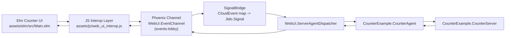

# Counter Example

Reference WebUi application that demonstrates Elm-to-Phoenix CloudEvents round-trips using a stateful counter.

This example is intended to be the canonical "small but complete" implementation for:
- channel-based CloudEvents transport
- `WebUi.ServerAgentDispatcher` routing
- Jido signal handling via `CounterExample.CounterAgent`
- backend state convergence and frontend reconnect behavior

Roadmap and phase status: [`PLAN.md`](./PLAN.md)

## Quick Start

### Prerequisites

- Elixir `~> 1.19`
- Erlang/OTP `27` or `28`
- Node.js (for Tailwind, esbuild, Elm, and Playwright tooling)

### Run Locally

From repo root:

```bash
mix setup
mix assets.build --force

cd examples/counter
mix deps.get
mix server
```

Open:
- [http://localhost:4100](http://localhost:4100)
- [http://localhost:4100/counter](http://localhost:4100/counter)

## Architecture

### Runtime Topology



### Component Responsibilities

- `assets/elm/src/Main.elm`: renders UI, sends command CloudEvents, applies `state_changed`, handles reconnect/error UX.
- `assets/js/web_ui_interop.js`: WebSocket/channel transport, queueing, reconnect, and E2E-only test hooks (`window.__WEBUI_E2E__`).
- `WebUi.EventChannel`: validates CloudEvent envelope and routes through dispatcher.
- `CounterExample.CounterAgent`: maps command event types to counter operations and emits `state_changed`.
- `CounterExample.CounterServer`: single source of mutable count state with guardrails and telemetry.

### Canonical Integration Decision

- Production path is `WebUi.ServerAgentDispatcher` + `CounterExample.CounterAgent`.
- `CounterExample.CounterEventHandler` remains a compatibility wrapper only.
- Decision record: [`../../notes/architecture/decision-003-counter-example-dispatch-path.md`](../../notes/architecture/decision-003-counter-example-dispatch-path.md)

## Event Contract Reference

Source of truth: `examples/counter/lib/counter_example/event_contract.ex`.

### Supported Event Types

| Direction | Type | Required Data Fields | Optional Data Fields |
| --- | --- | --- | --- |
| Client -> Server | `com.webui.counter.increment` | none | none |
| Client -> Server | `com.webui.counter.decrement` | none | none |
| Client -> Server | `com.webui.counter.reset` | none | none |
| Client -> Server | `com.webui.counter.sync` | none | none |
| Server -> Client | `com.webui.counter.state_changed` | `count`, `operation` | `correlation_id` |

### Envelope Rules

- Supported `specversion`: `"1.0"` only.
- Required CloudEvent attributes: `specversion`, `id`, `source`, `type`.
- Optional attributes: `data`, `time`.
- Client command source: `urn:webui:examples:counter:client`
- Server response source: `urn:webui:examples:counter`

### Correlation Rules

- If incoming command has `id`, response includes `data.correlation_id = <incoming id>`.
- If incoming command has no valid `id`, response omits `correlation_id`.

### Unknown or Invalid Events

- Unknown counter command types return `:unhandled`.
- Unsupported specversion returns `:unhandled`.
- Malformed channel payloads are surfaced to the UI as error states.

## Test Matrix

### Counter Example Unit/Integration

```bash
cd examples/counter
mix test
```

### Elm Frontend

```bash
npm run test:elm
# or
mix test.elm
```

### Browser E2E (Playwright)

```bash
npm run test:e2e:counter
# or
mix test.e2e.counter
```

E2E suite location: `examples/counter/e2e`.

## Phase 6 Release Gate

Run the full release checklist from repo root:

```bash
bash examples/counter/scripts/release_gate.sh
```

This command validates:
- counter example tests
- parent counter integration tests
- docs/contract drift checks
- Playwright E2E smoke flow

To run everything except E2E:

```bash
SKIP_E2E=1 bash examples/counter/scripts/release_gate.sh
```

Periodic maintenance: `.github/workflows/counter-maintenance.yml` runs a weekly
doc/contract drift check.

## Troubleshooting

### UI stays disconnected

- Verify server is running on `http://127.0.0.1:4100`.
- Confirm `examples/counter/config/dev.exs` keeps `WebUi.Endpoint` server enabled.
- Check browser console for WebSocket/channel errors.

### UI loads but counter actions do not update

- Ensure channel join succeeds (`events:lobby`).
- Verify `CounterExample.CounterAgent` is configured via `WebUi.ServerAgentDispatcher`.
- Confirm command buttons are enabled (connected state).

### Frontend changes are not reflected

- Rebuild assets from repo root:

```bash
mix assets.build --force
```

### E2E fails before browser launch

Install Playwright browser runtime once:

```bash
npx playwright install --with-deps chromium
```

### Asset watch mode

- `mix assets.watch` uses `file_system` when available.
- If `file_system` is unavailable, the task falls back to polling mode.
- Install `file_system` in dev for more efficient file change detection.

## How to Extend the Counter

Use this sequence to add a new command/event safely.

1. Extend event contract constants in `examples/counter/lib/counter_example/event_contract.ex`.
2. Add operation handling in:
   - `examples/counter/lib/counter_example/counter_agent.ex`
   - `examples/counter/lib/counter_example/counter_server.ex` (if state semantics change)
3. Add frontend trigger/update handling in `assets/elm/src/Main.elm`.
4. Add or update tests across:
   - `examples/counter/test/*`
   - `assets/elm/tests/MainTest.elm`
   - `examples/counter/e2e/tests/counter.spec.mjs` (if user-visible behavior changes)
5. Update this README event contract table and troubleshooting notes.

## Debugging Guide

### Useful Runtime Logs

Expected log patterns include:
- `counter_command_processed ...`
- `counter_command_error ...`
- `counter_server_error ...`

These are emitted by:
- `CounterExample.CounterAgent`
- `CounterExample.CounterServer`

### Telemetry Signals

Counter telemetry events:
- `[:counter_example, :counter_agent, :command, :stop | :error]`
- `[:counter_example, :counter_server, :operation, :stop | :error]`

### Quick Debug Workflow

1. Run `mix server` in `examples/counter`.
2. Open `/counter` and browser dev tools.
3. Trigger `increment/decrement/reset` and verify:
   - WebSocket connected status
   - `state_changed` payloads
   - server logs and telemetry events
4. If behavior diverges, run `mix test`, `npm run test:elm`, and `npm run test:e2e:counter`.

## Terminology

- **CloudEvent**: wire-format event envelope used over channel transport.
- **Jido Signal**: internal event representation used by dispatcher/agents.
- **WebUi.EventChannel**: Phoenix channel boundary for validation + routing.
- **WebUi.ServerAgentDispatcher**: routes signals to registered component agents.
- **CounterAgent**: command handler for counter domain events.
- **CounterServer**: in-memory state process for count mutations.

## Notes

- This example depends on the parent repo through `{:web_ui, path: "../.."}`.
- In dev, example app starts `WebUi.Endpoint` from `examples/counter/config/dev.exs`.
