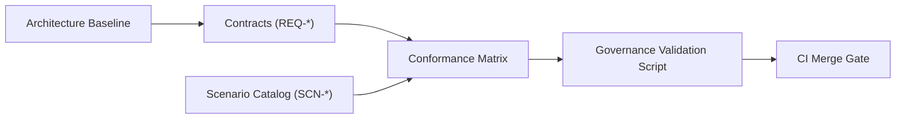

# WebUi Design Baseline

## Purpose

This document defines the architecture baseline for `web_ui`.

If another spec conflicts with this document, this document wins until an ADR resolves the conflict.

## Design Goals

- Provide a reusable Elixir library for event-driven web UI applications.
- Keep UI rendering logic deterministic and type-safe through Elm.
- Keep runtime business/state authority on the server via Elixir and Jido agents.
- Use CloudEvents-shaped envelopes as the canonical client/server protocol.
- Keep JavaScript interop explicit, minimal, and isolated behind Elm ports.
- Preserve clear governance and conformance pathways from day one.

## Non-Goals

- Shipping a full product app inside this repository.
- Supporting provider-specific client runtimes in core abstractions.
- Coupling UI behavior directly to persistence backend details.

## Canonical Contract Layer

Documents in `specs/contracts` are normative and component-level wording MUST NOT override contract semantics.

## Specification Governance Flow

## Core Concepts

| Concept | Definition | Owns State? |
|---|---|---|
| `Host Application` | Application using `web_ui` library | Yes |
| `Elm SPA` | Browser UI runtime implementing model/update/view | UI state only |
| `WebUi.Endpoint` | Phoenix endpoint serving assets and socket transport | No |
| `WebUi.EventChannel` | WebSocket transport boundary for event envelopes | No |
| `WebUi.CloudEvent` | Canonical envelope shape for transport payloads | No |
| `Jido Runtime` | Agent-based domain/runtime authority | Yes |
| `JS Interop Bridge` | Optional Elm port bridge for browser-specific behavior | No |

## Design Decisions

| Decision | Rationale | Tradeoff |
|---|---|---|
| Elm as default UI runtime | Strong type guarantees and deterministic updates | Requires Elm toolchain and skills |
| CloudEvents envelope for transport | Stable, explicit, and traceable event contract | Additional schema and envelope overhead |
| Server-side runtime authority | Avoids split-brain business logic | More backend event handling complexity |
| WebSocket-first interaction model | Low-latency bidirectional event flow | Requires robust reconnect/replay handling |
| JS interop through ports only | Contains unsafe browser operations at one boundary | Some features need extra bridge code |
| Governance-first specs workflow | Prevents architecture drift as implementation grows | Upfront documentation discipline cost |

## Runtime Lifecycle

1. Host app boots `web_ui` endpoint/router integration.
2. Browser loads Elm bundle and Tailwind styles.
3. Elm initializes model and opens WebSocket channel.
4. Elm emits envelope events for user interactions.
5. Channel validates and routes events into Jido/runtime handlers.
6. Runtime emits resulting events back through channel.
7. Elm applies updates and re-renders deterministic view state.

## Event Model Baseline

All runtime interaction envelopes SHOULD include:

- `specversion`
- `id`
- `source`
- `type`
- `time`
- `data`
- `correlation_id` (extension)

## Observability and Failure Baseline

- All transport and runtime failures MUST map to typed errors.
- Event correlation MUST be preserved across client and server boundaries.
- Disconnect/reconnect behavior MUST fail closed and re-establish deterministic state.

## Initial Implementation Phases

1. Baseline architecture and contract skeleton (spec-driven).
2. Transport contract and channel implementation.
3. Elm runtime bootstrap and CloudEvent codec path.
4. Jido runtime integration for first domain workflow.
5. Conformance scenario implementation and CI hardening.

## Canonical References

- [topology.md](/Users/Pascal/code/unified/web_ui/specs/topology.md)
- [boundaries.md](/Users/Pascal/code/unified/web_ui/specs/boundaries.md)
- [control_planes.md](/Users/Pascal/code/unified/web_ui/specs/control_planes.md)
- [spec_conformance_matrix.md](/Users/Pascal/code/unified/web_ui/specs/conformance/spec_conformance_matrix.md)
