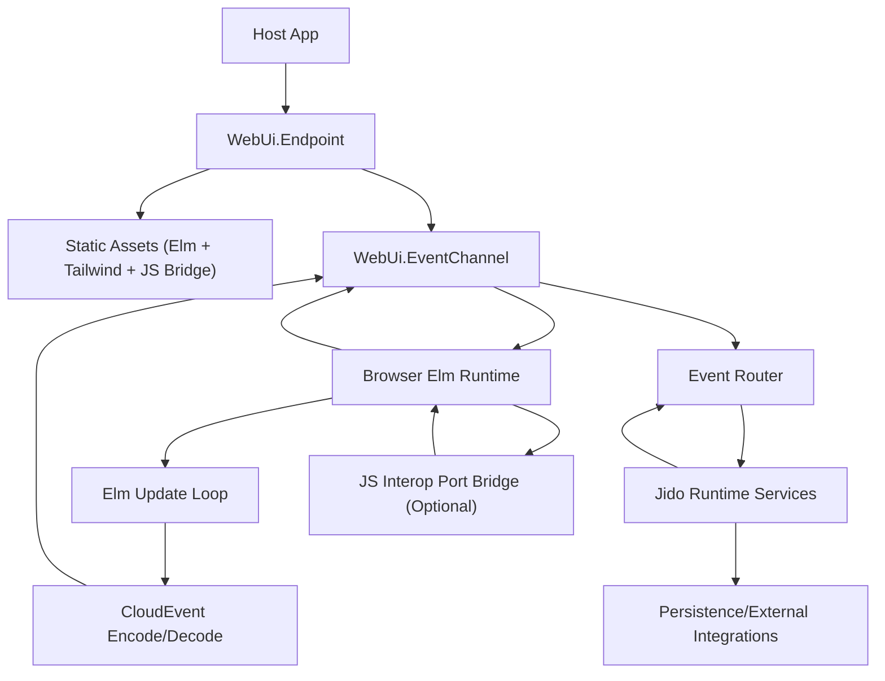
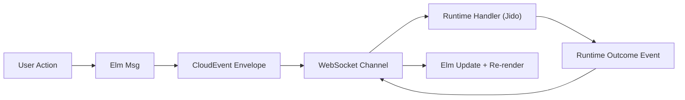

# WebUi Topology Baseline

## Purpose

This document defines the canonical system topology for `web_ui`.

It covers:

- runtime boundaries
- ownership and control flow
- event transport flow
- extension seams

## Core Topology Decisions

- Elm is the canonical browser UI runtime.
- Phoenix endpoint/channel is the canonical transport boundary.
- CloudEvents-shaped messages are the only cross-boundary runtime payload.
- Jido runtime services are the canonical backend state and behavior authority.
- JavaScript interop is optional and restricted to explicit port boundaries.

## System Topology

## Service Classes

| Class | Owner | State Ownership | Examples |
|---|---|---|---|
| Browser UI runtime | Client | UI-only | Elm model/update/view |
| Transport boundary | `web_ui` | No | Phoenix endpoint/channel |
| Runtime domain services | Host app via Jido | Yes | Jido agents/actions |
| Data integrations | Host app adapters | Yes | persistence API, external APIs |
| Browser extension seam | `web_ui` + host app | No | JS port bridge handlers |

## Event Interaction Flow

## Invariants

- Client/server boundary payloads MUST use CloudEvents-shaped envelopes.
- Runtime state mutation MUST occur in backend runtime services, not in JS bridge code.
- UI state updates MUST be driven by Elm message flow.
- Channel handlers MUST preserve event correlation identifiers.
- Optional JS interop MUST NOT become an alternate state authority.

## Out of Scope

- Product-specific screen catalog.
- Provider-specific model or integration behavior.
- Cross-repo packaging decisions.

## Conformance References

- [scenario_catalog.md](/Users/Pascal/code/unified/web_ui/specs/conformance/scenario_catalog.md)
- [spec_conformance_matrix.md](/Users/Pascal/code/unified/web_ui/specs/conformance/spec_conformance_matrix.md)
